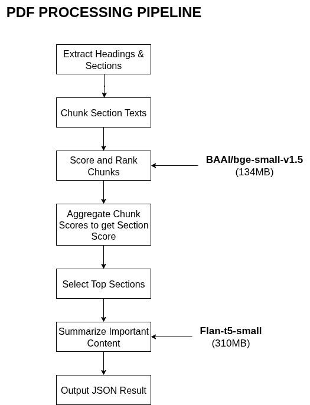

# PDF Heading Extraction and Insight Summarization Pipeline

A complete Python-based pipeline to extract hierarchical headings and section text from PDF documents, score and rank document sections against a user-defined task query using embeddings and keyword relevance, and generate concise insights summaries using an LLM (e.g., Flan-T5).

---

## Table of Contents
- [How to Run (Docker)](#how-to-run-docker)
  - [Build the Docker Image](#build-the-docker-image)
  - [Prepare Input Files](#prepare-input-files)
  - [Run the Container](#run-the-container)
  - [Find Your Output](#find-your-output)
- [Overview](#overview)
- [Pipeline Details](#pipeline-details)
- [Project Structure](#project-structure)
- [Configuration](#configuration)
- [Output Format](#output-format)
- [Dependencies](#dependencies)
- [License](#license)

---

## How to Run (Docker)

### Build the Docker Image

Build the Docker image containing all dependencies and your extraction/summarization scripts:

```
docker build --platform linux/amd64 -t mysolutionname:somerandomidentifier .
```

### Prepare Input Files

- Place your PDF documents inside a local folder, e.g., `/input/PDFs`.
- Prepare an input JSON specification describing the documents and query in `/input/input.json`, e.g.:

```
{
  "documents": [
    {"filename": "sample1.pdf"},
    {"filename": "sample2.pdf"}
  ],
  "persona": {
    "role": "Market Research Analyst"
  },
  "job_to_be_done": {
    "task": "Summarize key competitive intelligence insights"
  }
}
```

- **Verify with `tested_input` folder as to how the input should be**

### Run the Container

Run the container, mounting your input and output directories:

```
docker run --rm -v $(pwd)/input:/app/input -v $(pwd)/output:/app/output --network none mysolutionname:somerandomidentifier
```

- The container will:
  1. Extract headings and section texts from all PDFs in `/app/input`
  2. Save intermediate outlines in `/app/outlines`
  3. Score and rank the extracted text sections against the query task
  4. Generate concise summaries (insights) for top-ranked sections
  5. Write final aggregated output to `/app/output/output.json`

### Find Your Output

- The extracted JSON outlines per PDF are saved in `/output/outlines/`
- The final report with ranked sections and summaries is saved as `/output/output.json`

---

## Overview

This project combines PDF structural analysis and modern NLP techniques to help you:

- Automatically parse hierarchical headings (H1, H2, H3) and their section texts from PDFs.
- Score and rank document sections' relevance to a custom query using vector embeddings and keyword heuristics.
- Generate concise, personalized insight summaries per section with state-of-the-art summarization models.

---

## Pipeline Details

### 1. PDF Heading Extraction & Section Text Retrieval from Task 1A
- Uses PyMuPDF to extract text spans with font size and style info.
- Filters out decorative/non-informative text.
- Dynamically thresholds indentation and line spacing to infer heading hierarchy.
- Outputs structured outlines with headings and optionally their full section text.

### 2. Section Chunking
- Splits section texts into manageable token chunks (default 500 tokens) for embedding and summarization.

### 3. Embedding-based Scoring

- **Uses the bge-small model for text embeddings:** For every chunk, vector embeddings are generated using the efficient and high-quality `bge-small-v1.5 (134MB)` embedding model. This model captures semantic meaning in compact representations, enabling accurate relevance scoring.
- Generates embeddings for each chunk and the user-provided query.
- Computes cosine similarity and keyword relevance score.
- Combines scores to rank chunks and filter out less relevant ones.

### 4. Section Aggregation & Ranking
- Groups chunks by document and section title.
- Computes average relevance scores per section.
- Dynamically detects score drop-offs to select top relevant sections.

### 5. Insight Summarization
- Uses a fine-tuned summarization model, `Flan-T5-small (310MB)` with beam search to generate high-quality summaries.
- **Beam search (`num_beams=4`)** keeps multiple candidate summaries in consideration at each step, improving coherence and informativeness.
- Controlled sampling (`do_sample=True`, `temperature=0.7`) adds diversity, enabling personalized and non-repetitive summaries.
- These methods help generate concise insights tailored to the persona and task from relevant document sections.





---

## Project Structure

```
/app
│
├── extract_headings.py          # PDF heading extraction code
├── process_pdfs.py              # PDF batch extraction script
├── score.py                     # Chunk scoring utilities
├── summary.py                   # Extracts insights summaries via transformers
├── config.py                    # Configuration constants for embedding, model paths, thresholds
├── Dockerfile                   # Docker build file
├── requirements.txt             # Python dependencies
├── input/                       # Place input PDF files and input.json spec here
├── outlines/                    # Intermediate JSON outlines are saved here
└── output/                      # Final extracted and summarized output JSON here
```

---

## Configuration

Edit `config.py` to tune:

- `EMBEDDING_PATH`: Path to embedding model directory
- `JOB_PERFORMER_PATH`: Path to summarization model directory
- `COSINE_THRESHOLD`: Minimum cosine similarity threshold for chunk relevance
- `DROP_RATIO`: Score gap ratio threshold for top section selection
- `MAX_SECTIONS`: Maximum number of sections to keep for summarization

---

## Output Format

- **Outlines JSON per PDF** (in `/outlines` directory):
  - Contains `title` string and `outline` list with heading levels, texts, pages, and optionally section texts.
- **Final aggregated output JSON** (`output/output.json`):
  - Contains metadata about input, persona, query task
  - Lists top ranked sections with importance rank, section titles, page numbers
  - Includes extracted concise insights per document section chunk

---

## Dependencies

- Python 3.10+
- PyMuPDF (`fitz`)
- NLTK
- scikit-learn
- transformers (HuggingFace)
- HuggingFace `langchain_huggingface` embeddings wrapper
- tqdm